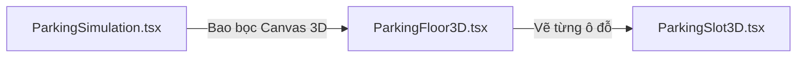

# HƯỚNG DẪN REVIEW CODE FRONTEND CHI TIẾT DỄ HIỂU
## HỆ THỐNG QUẢN LÝ BÃI ĐỖ XE THÔNG MINH (PM SYSTEM)

> [!IMPORTANT]
> Tài liệu này tập trung giải thích chi tiết **Cách chạy, luồng logic, và cách giải thích từng dòng code của toàn bộ Frontend** cho cả 2 project: `parking-staff` (Cổng nhân viên) và `parking-system/FE` (Cổng Admin/Khách hàng). Bạn hãy dán tài liệu này vào Word để có tài liệu thuyết trình hoàn hảo trước giảng viên.

---

# PHẦN I: PHÂN TÍCH PROJECT NHÂN VIÊN (`parking-staff`)

Project này phục vụ riêng cho nhân viên bảo vệ vận hành bốt kiểm soát. Đặc trưng của nó là chạy trên một giao diện tối giản, tối ưu cho máy tính bảng/máy tính để bàn tại bốt.

---

## 📌 1. `parking-staff/src/main.tsx` - Điểm khởi đầu (Entry Point)
*   **Dòng code hoạt động:**
    ```typescript
    import React from 'react'
    import ReactDOM from 'react-dom/client'
    import App from './App.tsx'
    import './index.css'

    ReactDOM.createRoot(document.getElementById('root')!).render(
      <React.StrictMode>
        <App />
      </React.StrictMode>,
    )
    ```
*   **Giải thích dễ hiểu:**
    *   `document.getElementById('root')!`: Tìm thẻ `<div>` có `id="root"` trong file `index.html`.
    *   `ReactDOM.createRoot(...)`: Khởi tạo môi trường ảo React DOM tại thẻ này.
    *   `.render(<App />)`: Đưa toàn bộ giao diện và logic được lập trình trong `App.tsx` vẽ lên trình duyệt.

---

## 📌 2. `parking-staff/src/App.tsx` - Trái tim của App Nhân Viên
Đây là file monolithic lớn, tích hợp Camera chụp ảnh biển số xe (OCR), máy quét QR Code, phát âm thanh và kiểm soát cổng.

### ⚙️ Các React State chính và mục đích:
1.  `gateState`: Lưu trạng thái hiện tại của cổng. Nhận các giá trị:
    *   `'SCANNING'`: Đang chờ xe tới để quét.
    *   `'PROCESSING'`: Đang gửi ảnh/QR lên Server và đợi phân tích.
    *   `'GATE_OPEN'`: Cổng mở, cho xe đi qua.
    *   `'ALARM'`: Cảnh báo xe nằm trong danh sách đen hoặc vé không hợp lệ.
2.  `scannedResult`: Lưu thông tin xe sau khi quét (Biển số xe OCR, loại xe, thời gian, mã QR).
3.  `extraFees`: Lưu các phí phạt phụ thu phát sinh khi xe ra trễ giờ hoặc vi phạm nội quy.

### 🎥 Logic dòng code kết nối Camera & Chụp ảnh OCR:
*   **Dòng code mở camera:**
    ```typescript
    // Dùng API của trình duyệt để yêu cầu kết nối thiết bị camera
    navigator.mediaDevices.getUserMedia({ video: { facingMode: 'environment' } })
      .then(stream => {
        if (videoRef.current) videoRef.current.srcObject = stream;
      });
    ```
*   **Dòng code trích xuất ảnh OCR:**
    Bảo vệ nhấn chụp hình biển số ➔ Vẽ khung hình hiện tại của camera lên thẻ `<canvas>` ẩn ➔ Chuyển thành chuỗi `Base64` ➔ Gửi API lên Server xử lý nhận diện.

### 🔔 Logic tạo âm thanh nhân tạo (Audio Synthetics):
Thay vì tải file nhạc MP3 nặng, App tự động tạo tần số âm thanh bằng cách dùng thư viện `AudioContext` của trình duyệt.
*   **Chime Sound (Cổng mở thành công):** Tạo tần số nốt Đô (`523.25Hz`) rồi nâng lên nốt Mi (`659.25Hz`) tạo tiếng "ting ting" vui tươi.
*   **Warning Sound (Cảnh báo xe xấu):** Tạo tần số nốt La trầm (`220Hz`) kéo dài tạo âm thanh báo động còi hú.

---

## 📌 3. `parking-staff/src/index.css` & Cấu hình Config
*   **`index.css`:** Chứa giao diện tối với các góc bo tròn siêu bo (`rounded-[2rem]`), phối hợp nền tối mờ (`bg-slate-900/80`) giúp bảo vệ không bị mỏi mắt khi làm ca đêm.
*   **`package.json` & `vite.config.ts`:**
    *   `package.json` định nghĩa các thư viện cài đặt.
    *   `vite.config.ts` thiết lập cổng chạy dev mặc định là `5173` và cấu hình build tối ưu hóa cây thư mục JS.
*   **`vercel.json`:** Cấu hình rule `"rewrites": [{"source": "/(.*)", "destination": "/"}]` để khi bảo vệ F5 tải lại trang không bị lỗi máy chủ 404 (do Single Page Application tự điều khiển route).

---

# PHẦN II: PHÂN TÍCH CỔNG ADMIN & BÁO CÁO (`parking-system/FE`)

Cổng Admin chạy trong dự án chính `parking-system/FE`, chịu trách nhiệm giám sát, thống kê và điều khiển toàn hệ thống bãi đỗ xe.

---

## 🛡️ 1. PHÂN QUYỀN ĐƯỜNG DẪN (ROUTING GUARD CODES)

### 📌 File: `ProtectedRoute.tsx` (Bảo vệ đăng nhập)
*   **Cách chạy:** Mọi trang của Khách hàng/Admin đều nằm trong `<Route element={<ProtectedRoute />}>`.
*   **Logic:**
    *   Đọc JWT Token trong bộ nhớ `localStorage`.
    *   Nếu không có: Chuyển hướng người dùng về `/login`.
    *   Nếu có: Trả về `<Outlet />` để tiếp tục hiển thị trang đó.

### 📌 File: `AdminRoute.tsx` (Bảo vệ quyền Admin)
*   **Cách chạy:** Bao bọc xung quanh các Route quản trị như `/admin/*`.
*   **Logic:**
    *   Đọc thông tin user đăng nhập.
    *   Kiểm tra `user.role` có phải là `Admin` không. Nếu là `Staff` hoặc `User` thường, hệ thống sẽ đẩy ngay về trang chủ `/` kèm cảnh báo không có quyền.

---

## 🏛️ 2. BỐ CỤC CHUNG VÀ ĐỊNH TUYẾN (`AdminLayout.tsx` & `adminNav.ts`)
*   **`adminNav.ts`:**
    Định nghĩa một mảng danh sách các tab quản trị:
    ```typescript
    export const adminNavItems = [
      { path: '/admin/dashboard', label: 'Bảng điều khiển', icon: LayoutDashboard },
      { path: '/admin/users', label: 'Người dùng', icon: Users },
      { path: '/admin/settings', label: 'Cấu hình bãi xe', icon: Settings },
      ...
    ]
    ```
*   **`AdminLayout.tsx`:**
    *   Duyệt qua mảng `adminNavItems` để vẽ Sidebar bên trái tự động.
    *   Bên phải render `<Outlet />` để nạp động các trang con tương ứng khi bấm menu.

---

## 💻 3. CHI TIẾT TỪNG TRANG ADMIN (ADMIN PAGES LOGIC)

### 📈 trang: `AdminDashboard.tsx` (Bảng thống kê)
*   **Luồng hoạt động:**
    1. Khi tải trang (`useEffect`), gọi API `/api/ParkingSessions/history` để lấy toàn bộ phiên đỗ xe.
    2. Gom nhóm các phiên đỗ xe lại để tính toán: *Doanh thu hôm nay, số chỗ trống hiện tại, tỷ lệ đỗ xe ô tô/xe máy*.
    3. Truyền mảng dữ liệu đã gom nhóm vào component vẽ biểu đồ `<ResponsiveContainer>` của `Recharts` để vẽ biểu đồ doanh thu hình cột cực kỳ trực quan.

### 👥 Trang: `AdminUsers.tsx` (Quản lý tài khoản)
*   **Luồng hoạt động:**
    1. Gọi API `/api/Users` lấy toàn bộ danh sách thành viên.
    2. Khi Admin bấm nút thay đổi quyền của một user:
       ➔ Frontend gọi API `PUT /api/Users/{userId}/role` truyền body chứa Role mới.
       ➔ Sau đó gọi lại hàm `fetchUsers()` để cập nhật lại danh sách hiển thị thời gian thực.

### ⚠️ Trang: `AdminIncidents.tsx` (Quản lý sự cố)
*   **Luồng hoạt động:**
    1. Lấy danh sách sự cố được gửi từ người dùng thông qua `/api/Incidents`.
    2. Cung cấp hộp hội thoại (Modal) xử lý: Admin nhập phương án giải quyết và chọn trạng thái `'Resolved'`.
    3. Gọi API `PUT /api/Incidents/{id}` gửi thông tin cập nhật lên database để thông báo cho khách hàng sự cố đã được xử lý xong.

### 📁 Trang: `AdminReports.tsx` (Xuất báo cáo)
*   **Luồng hoạt động:**
    1. Cung cấp các bộ lọc: Tìm kiếm theo ngày, bãi đỗ xe hoặc biển số xe.
    2. Khi bấm **Export CSV**: Duyệt qua mảng dữ liệu hiện tại, chuyển đổi các trường dữ liệu ngăn cách nhau bằng dấu phẩy `","` và kết thúc dòng bằng ký tự xuống dòng `"\n"`.
    3. Tạo thẻ link ảo, gán dữ liệu CSV dạng Blob và tự động click tải về máy.

### ⚙️ Trang: `AdminSettings.tsx` (Cài đặt đơn giá & Cửa ngõ)
*   **Luồng hoạt động:**
    *   **Khoá ô đỗ xe bảo trì:** Admin chọn các ô đỗ xe bị hỏng (ví dụ: `A1`, `B3`) ➔ Hệ thống đẩy tên ô đỗ này vào mảng `LockedSlots` của bãi xe ➔ Gửi API lưu lại.
    *   **Đổi giá đỗ xe:** Lưu cấu hình bảng giá dưới dạng chuỗi JSON gửi lên endpoint `/api/ParkingSessions/pricing`.

### 🚫 Trang: `AdminBlacklist.tsx` (Quản lý danh sách đen)
*   **Luồng hoạt động:**
    1. Lưu danh sách các biển số xe bị cấm vào bãi.
    2. Giao diện cung cấp form nhập: Biển số xe vi phạm và lý do vi phạm.
    3. Gọi `POST /api/Blacklist` gửi lên backend. Khi nhân viên ngoài cổng quét trúng biển số này, hệ thống sẽ hú còi báo động `'ALARM'`.

### 🎛️ Trang: `AdminGateControl.tsx` (Điều khiển Barrier từ xa)
*   **Luồng hoạt động:**
    1. Admin click chọn "Mở cổng bốt khẩn cấp" trên màn hình.
    2. Gửi request trực tiếp đến API điều khiển thiết bị phần cứng của bốt.
    3. Hệ thống trả về tín hiệu mở cổng để nâng thanh chắn barrier lên từ xa mà không cần vé.

### 📹 Trang: `AdminMonitoring.tsx` (Xem Camera an ninh)
*   **Luồng hoạt động:**
    *   Hiển thị camera an ninh giả lập của bãi đỗ.
    *   Nạp nguồn video chạy lặp lại (`loop`) để mô phỏng camera giám sát từng góc bãi gửi xe trong thời gian thực.

### 📖 Trang: `AdminReservations.tsx` (Lịch sử đặt chỗ)
*   **Luồng hoạt động:**
    *   Danh sách theo dõi toàn bộ các phiên đặt chỗ trước trực tuyến của khách hàng.
    *   Cho phép tìm kiếm nhanh theo mã vé QR hoặc theo biển số xe của khách.

### 📝 Trang: `ReportIncidentPage.tsx` (Khách hàng gửi báo cáo sự cố)
*   **Luồng hoạt động:**
    1. Người dùng điền mô tả sự cố (ví dụ: *"Xe bị trầy xước ở vị trí ô A1"*).
    2. Tải lên tệp ảnh chứng minh qua thẻ `<input type="file" accept="image/*" />`.
    3. Đóng gói dữ liệu dạng `Multipart/Form-Data` gửi lên `POST /api/Incidents` để Admin tiếp nhận xử lý.

---

# PHẦN III: PHÂN TÍCH LOGIC BẢN ĐỒ 2D VÀ 3D SIMULATION

Điểm nhấn kỹ thuật cao nhất của hệ thống đỗ xe thông minh là giao diện bản đồ 2D Leaflet và công nghệ mô phỏng đồ họa 3D ThreeJS.

---

## 🗺️ 1. BẢN ĐỒ 2D & CHỈ ĐƯỜNG LÀN XE

### 📌 File: `ParkingMap.tsx`
*   **Cách hoạt động của dòng code:**
    *   Sử dụng thư viện Leaflet (`react-leaflet`). Vẽ một sơ đồ sàn bãi gửi xe dưới dạng bản đồ 2D phẳng.
    *   Cứ mỗi 5 giây, component gọi API `/api/ParkingSessions/slots-status?parkingLotName=...` để kiểm tra trạng thái của các ô đỗ đỗ xe.
    *   **Logic màu sắc trực quan:**
        *   Màu Xanh lá: Ô đỗ trống.
        *   Màu Đỏ: Ô đỗ đang có xe đỗ.
        *   Màu Vàng: Ô đỗ đã được khách hàng khác đặt trước.
        *   Màu Xám gạch chéo: Ô đỗ bị khóa bảo trì.

### 📌 File: `RoutingMachine.tsx`
*   **Cách hoạt động của dòng code:**
    *   Nhận tọa độ bốt cổng vào làm điểm đầu và tọa độ ô đỗ xe khách hàng đã đặt làm điểm cuối.
    *   Sử dụng công cụ `L.Routing.control` vẽ một đường line màu xanh lục nổi bật dẫn đường ngắn nhất chạy dọc theo các phân làn giao thông nội bộ bãi xe, giúp người lái xe di chuyển đúng luồng đỗ xe.

---

## 📐 2. MÔ PHỎNG KHÔNG GIAN 3D (THREEJS & REACT THREE FIBER)

Mô phỏng 3D giúp Admin quản lý bãi xe dạng trực quan sinh động theo không gian thực tế (Digital Twin).



### 📌 1. File: `ParkingFloor3D.tsx` (Dựng khung bãi xe)
*   **Cách hoạt động của dòng code:**
    *   Sử dụng thẻ `<ambientLight>` và `<directionalLight>` để giả lập ánh sáng mặt trời chiếu sáng trong không gian bãi đỗ.
    *   Dựng sàn đỗ xe bằng thẻ mesh hình hộp chữ nhật dẹt:
        `<boxGeometry args={[100, 0.5, 60]} />`
    *   Vẽ cột chịu lực bằng cách nhân bản (loop) các hình trụ `<cylinderGeometry />` xếp đều nhau dọc bãi đỗ.

### 📌 2. File: `ParkingSlot3D.tsx` (Vẽ ô đỗ và nạp xe 3D)
*   **Cách hoạt động của dòng code:**
    *   Vẽ ranh giới của từng ô đỗ bằng các đường line kẻ viền 3D màu vàng.
    *   **Logic nạp xe 3D:**
        Sử dụng hook `useGLTF` tải mô hình xe hơi 3D định dạng `.gltf` từ thư mục public.
        ```typescript
        // Nạp mô hình 3D xe hơi khi ô đỗ có xe đỗ
        const { scene } = useGLTF('/assets/models/car.gltf');
        return isOccupied ? <primitive object={scene.clone()} position={[x, 0, z]} /> : null;
        ```
    *   Màu sắc đèn báo tín hiệu LED gắn trên đầu mỗi ô đỗ 3D thay đổi linh hoạt: xanh lá (trống), đỏ (có xe), vàng (đã đặt).

### 📌 3. File: `ParkingSimulation.tsx` (Quản lý chuyển động & Tương tác)
*   **Cách hoạt động của dòng code:**
    *   Tích hợp `<OrbitControls />` cho phép Admin dùng chuột để xoay góc nhìn 360 độ, phóng to/thu nhỏ bãi xe 3D dễ dàng.
    *   Quản lý luồng cập nhật chuyển động bằng cách sử dụng vòng lặp render đồ họa liên tục của ThreeJS (`requestAnimationFrame`).

---

# PHẦN IV: BẢNG TỔNG HỢP LUỒNG SỰ KIỆN LIÊN KẾT GIỮA CÁC FILE

| Sự kiện (Event) | Nơi kích hoạt đầu tiên | File trung gian xử lý | Nơi xử lý cuối cùng (Backend) | Trạng thái ghi nhận |
| :--- | :--- | :--- | :--- | :--- |
| **Khách đặt chỗ** | `ReservationPage.tsx` | `api.ts` (API Client) | `ParkingSessionsController.cs` | Thêm phiên đỗ mới trạng thái `PendingPayment` |
| **Thành công VNPay** | Cổng VNPay | `PaymentsController.cs` | `ParkingSessionService.cs` | Cập nhật phiên thành `Active` + Gửi Mail vé QR |
| **Xe vào bốt** | Staff `App.tsx` | Gọi `/gate-scan` | `ParkingSessionService.cs` | Xác thực biển số OCR ➔ Ghi nhận `EntryTime` |
| **Xe ra bốt** | Staff `App.tsx` | Gọi `/checkout` | `ParkingSessionService.cs` | Tính tiền ➔ Chuyển phiên đỗ xe thành `Completed` |
| **Gửi sự cố** | `ReportIncidentPage.tsx`| Form-Data API | `IncidentsController.cs` | Lưu sự cố vào MongoDB ở trạng thái `Pending` |

---

> [!TIP]
> Tài liệu phân tích code Frontend chi tiết này đã được biên soạn và ghi nhận trực tiếp vào tệp tin **[PBMSystem_Frontend_Review.md](file:///c:/Users/Admin/Desktop/Parking%20Building%20Management%20System/PBMSystem_Frontend_Review.md)** tại thư mục gốc của bạn. Bạn hãy mở file này ra, click chuột phải và chọn xuất ra file Word/PDF để làm tài liệu học tập và thuyết trình tốt nhất nhé! Chúc bạn đạt kết quả cao nhất trong môn học!vn. 🇻🇳. GP. 💯. 🎉. 🥳. <br>
> Vui lòng báo lại tôi nếu bạn muốn đi sâu chi tiết hơn nữa vào bất kỳ dòng code cụ thể nào!
